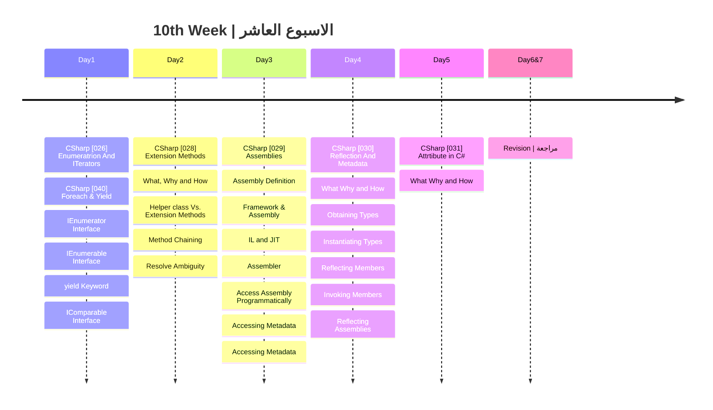

## الشهر الثالث

###  الهدف من الاسبوع العاشر

- فهم التكرار والمفاتيح المحورية في اللغة: تغطية أساسيات التكرار والمفاتيح مثل 'yield' وواجهات مثل IEnumerator وIEnumerable.
- إتقان توسيع الطرق (Extension Methods): فهم كيف ولماذا تستخدم طرق التوسيع وكيف تقارن مع طرق المساعدة.
- استكشاف الأسمبليات: فهم ماهية الأسمبليات وكيف يتم التفاعل معها في عملية التنفيذ.
- تعمق في العكس والبيانات الوصفية (Reflection and Metadata): فهم كيف يمكن استخدام Reflection للتفاعل مع الأنواع والأعضاء في وقت التشغيل.
- استخدام السمات (Attributes) بفعالية: فهم كيفية استخدام السمات في C# لإضافة معلومات وصفية للكود.
- مراجعة شاملة: تقييم ما تم تعلمه وتحديد المجالات التي قد تحتاج لتحسين.

|Lesson | Link |
| :---: | :---: | 
|CSharp [026] | https://youtu.be/qvqp9qJnigs|
|CSharp [040] | https://youtu.be/z6eBV2iPEC8|  
|CSharp [028] | https://youtu.be/AdperlFqPWQ|  
|CSharp [029] | https://youtu.be/X1IPGHZ1yJw|  
|CSharp [030] | https://youtu.be/hkuBpG0QyrU|  
|CSharp [031] | https://youtu.be/UkGF0SJzDN4|  

---
