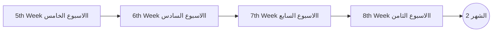
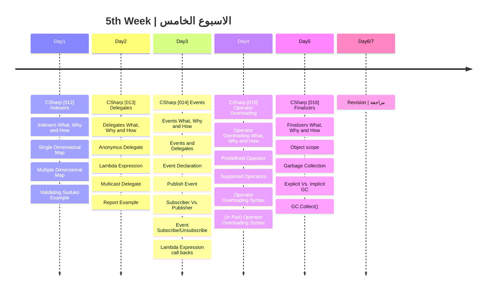

## الشهر الثاني

###  الهدف من الاسبوع الخامس
- التعرف على Class Members
  1. الفهارس Indexers
  2. الاحداث Events
  3. ال Operator Overloading
  4. ال Finalizers
- التعرف على Delegate

|Lesson | Link |
| :---: | :---: | 
|CSharp [012] | https://youtu.be/2LXzNQSTHTc | 
|CSharp [013] | https://youtu.be/rvNJrgj6ilg|
|CSharp [014] | https://youtu.be/8aWHZncV95Q|
|CSharp [015] | https://youtu.be/F3ryldPGQoM|
|CSharp [016] | https://youtu.be/Cm6mKU2cQls|
|CSharp [017] | https://youtu.be/-gWx_NILonQ|

---
