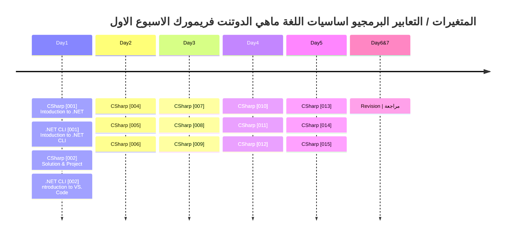
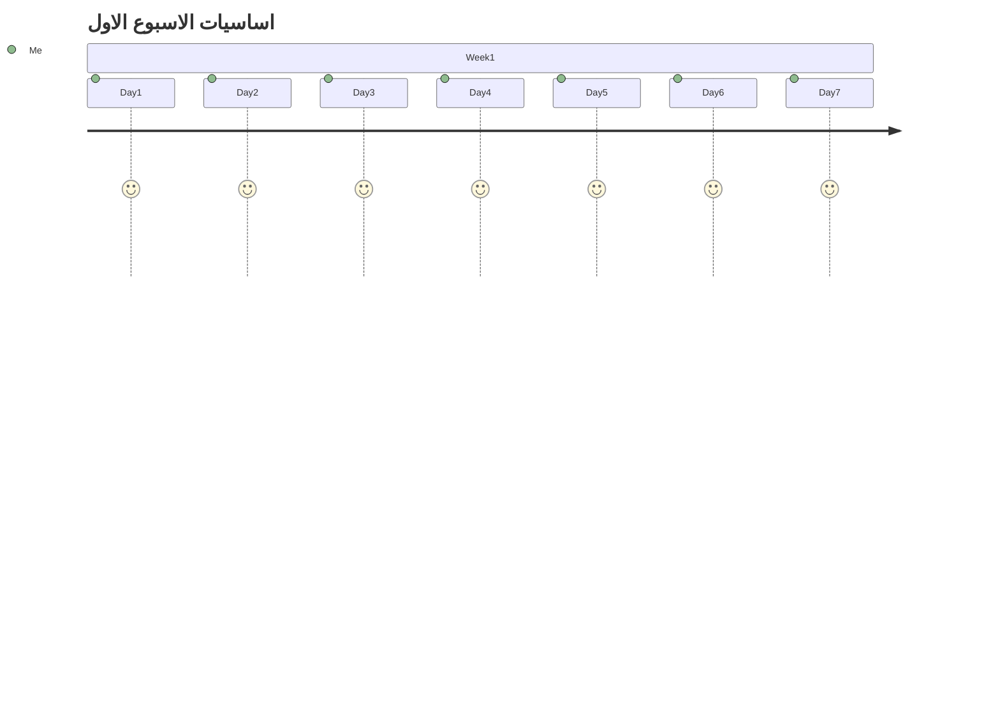
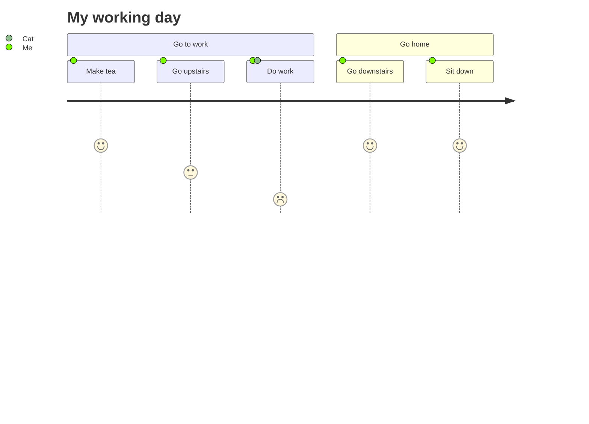

```mermaid
timeline
    title  المتغيرات / التعابير البرمجيو اساسيات اللغة ماهي الدوتنت فريمورك  الاسبوع الاول 
    Day1 : CSharp [001] Intoduction to .NET
         : .NET CLI [001] Intoduction to .NET CLI
         : CSharp [002] Solution & Project
         : .NET CLI [002] ntroduction to VS. Code
 
    Day2 : CSharp [004]
         : CSharp [005] 
         : CSharp [006] 
    Day3 : CSharp [007]
         : CSharp [008]
         : CSharp [009] 
    Day4 : CSharp [010]
         : CSharp [011]
         : CSharp [012] 
    Day5 : CSharp [013]
         : CSharp [014]
         : CSharp [015] 
  Day6&7 : Revision | مراجعة 
```

```mermaid
journey
    title  اساسيات الاسبوع الاول
    section Week1
      Day1 : 5: Me
      Day2 : 5: Me
      Day3 : 5: Me 
      Day4 : 5: Me
      Day5 : 5: Me
      Day6 : 5: Me
      Day7 : 5: Me
```

```mermaid
journey
    title My working day
    section Go to work
      Make tea: 5: Me
      Go upstairs: 3: Me
      Do work: 1: Me, Cat
    section Go home
      Go downstairs: 5: Me
      Sit down: 5: Me
```
 
