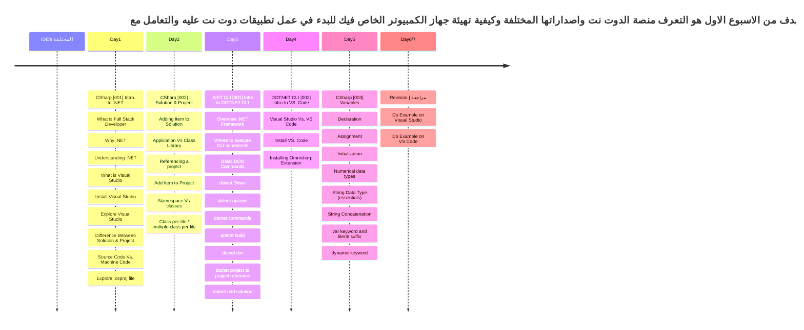
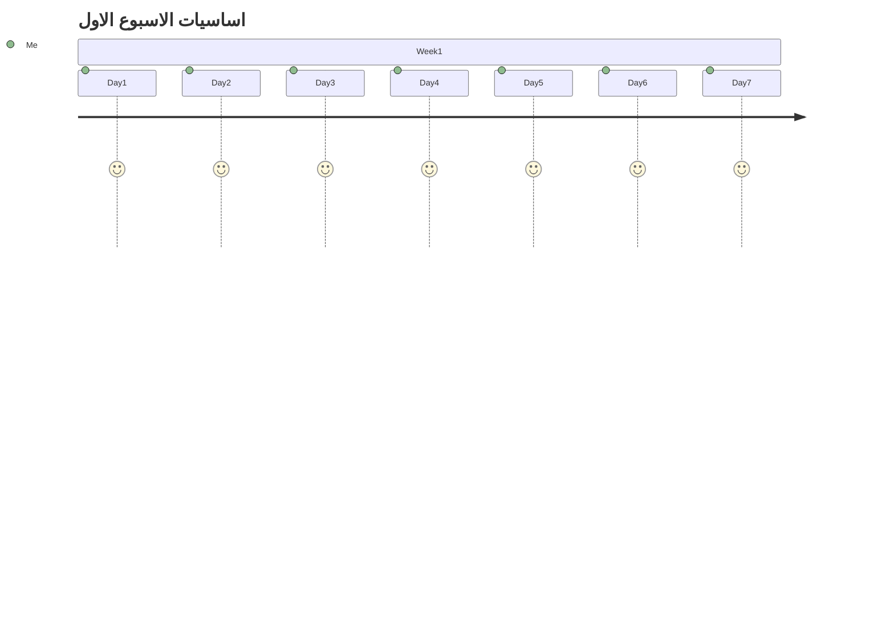
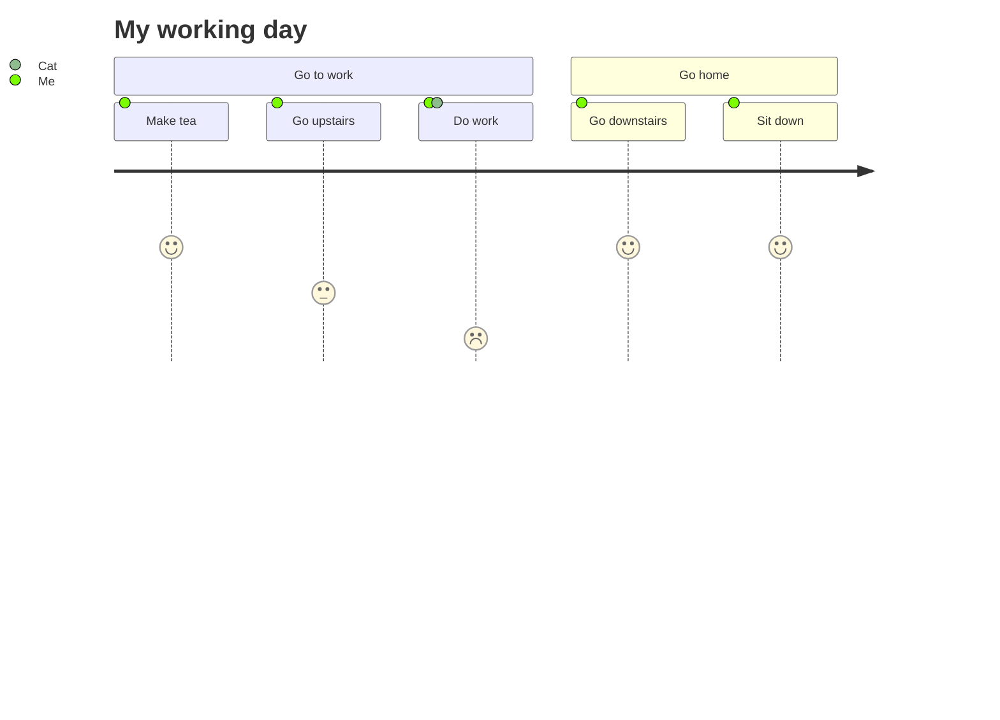

### يفترض في من يريد متابعة خارطة الطريق ان يكون خريج حاسبات او هندسة حاسبات او اي تخصص قام بشرح اساسيات علوم الكمبيوتر او دورة اوفلاين او اونلاين
### لكل من ليس له علاقة ب علوم الحاسب ويريد متابعة خارطة الطريق الرجاء اكمال دورة CS50 من جامعة هارفرد فهي تمثل تمهيد جيد للبدء في التراك

رابط الدورة: https://cs50.harvard.edu/x/2023/#welcome 

 
