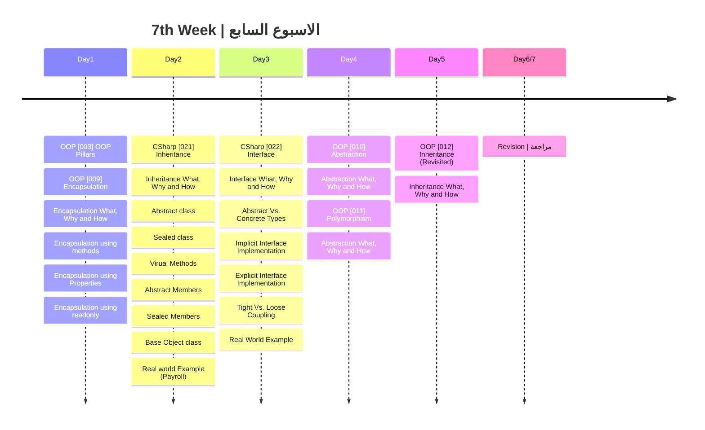

## الشهر الثاني

###  الهدف من الاسبوع السابع
- التعرف على اعمدة ال OOP
  1. ال Encapsulation
  2. ال Abstraction
  3. ال Polymorphism
  4. ال Inheritance
- التعرف على العديد من انواع الكلاس (Sealed, Abstract, Static)
- اعضاء الكلاس (sealed, virtual, abstract)
- التعرف على method overriding
- معرفة اساسيات الفرق بين Tight Vs. Loose Coupling
ٍ- التطبيق العملي لمسائل تلامس الواقع (نظام رواتب) ونظام (بنكي)

|Lesson | Link |
| :---: | :---: | 
|OOP [03] | [https://youtu.be/-gWx_NILonQ](https://youtu.be/M4VjTVO8Rbw) | 
|OOP [009] | https://youtu.be/TbAPLaruUjE|
|CSharp [021] | https://youtu.be/cw1BXqkok1k|
|CSharp [022] | https://youtu.be/02EEtFtes_0| 
|OOP [010] | https://youtu.be/TUfatzFvASU|
|OOP [011] | https://youtu.be/twon_3eUXRo|
|OOP [012] | https://youtu.be/a1d9y-wxXbs|

---
