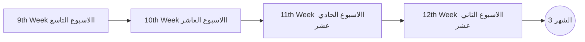
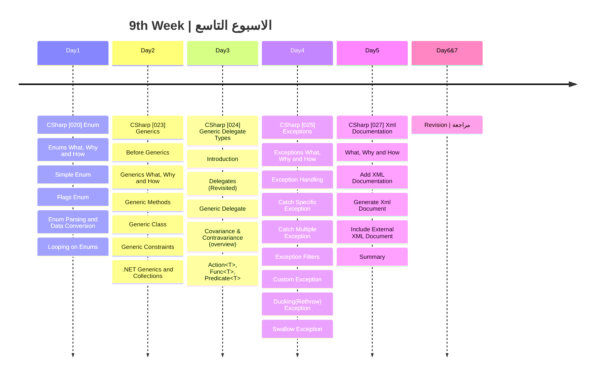

## الشهر الثالث

###  الهدف من الاسبوع التاسع

- فهم وتطبيق الـ Enums: استيعاب أساسيات واستخدامات الEnumerations في C#.
- اكتشاف قوة الجنريكس: فهم كيفية تبسيط الكود وزيادة إعادة الاستخدام عبر Generics.
- التعمق في الجنريك ديليجيت تايبس: فهم كيفية العمل مع المفاهيم المتقدمة مثل Covariance و Contravariance.
- إتقان معالجة الاستثناءات: تعلم كيفية التعامل مع الأخطاء والاستثناءات بفعالية.
- التعرف على توثيق XML: استخدام التوثيق لتسهيل فهم واستخدام الكود البرمجي.
- مراجعة شاملة: تقييم ما تم تعلمه وتحديد المجالات التي قد تحتاج لتحسين.

|Lesson | Link |
| :---: | :---: | 
|CSharp [020] | https://youtu.be/3pbfQ-ZDoyc|
|CSharp [023] | https://youtu.be/xE6bS6EfKAc| 
|OOP [024] | https://youtu.be/QgiaxQa2ccw|
|OOP [025] | https://youtu.be/mA1pOrYAHCU|
|OOP [027] | https://youtu.be/CoBhSJiZCSA|

---
