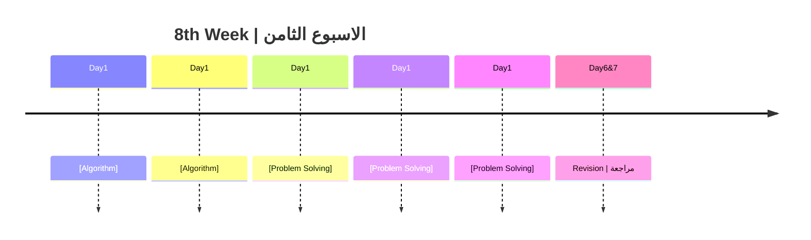

## الشهر الثاني

```mermaid
graph LR
    A[5th Week االاسبوع الخامس]--> B((Square Rect))
    B[6th Week االاسبوع السادس]--> C((Square Rect))
    C[7th Week االاسبوع السابع]--> D((Square Rect))
    D[8th Week االاسبوع الثامن]--> E((الشهر 2))
```

```mermaid
timeline
    title  8th Week | الاسبوع الثامن
    Day1 : [Algorithm]
    Day1 : [Algorithm]
    Day1 : [Problem Solving]
    Day1 : [Problem Solving]
    Day1 : [Problem Solving]
  Day6&7 : Revision | مراجعة  
```
###  الهدف من الاسبوع الثامن
- فهم أساسيات خوارزميات الفرز والبحث
- تطبيق خوارزميات بسيطة باستخدام لغة برمجة محددة
- تحليل الأداء والتعقيد الزمني للخوارزميات المطبقة

---
