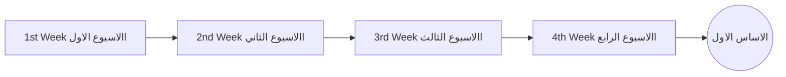
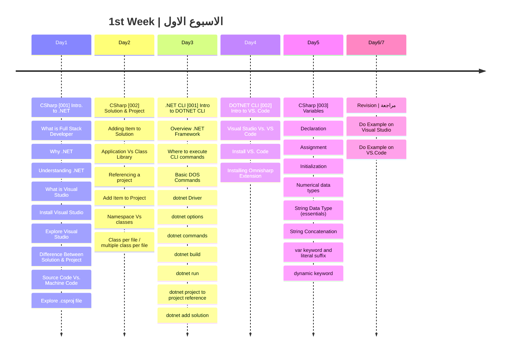

### يفترض في من يريد متابعة خارطة الطريق ان يكون خريج حاسبات او هندسة حاسبات او اي تخصص قام بشرح اساسيات علوم الكمبيوتر او دورة اوفلاين او اونلاين
### لكل من ليس له علاقة ب علوم الحاسب ويريد متابعة خارطة الطريق الرجاء اكمال دورة CS50 من جامعة هارفرد فهي تمثل تمهيد جيد للبدء في التراك

رابط الدورة: https://cs50.harvard.edu/x/2023/#welcome

 < ####الشهر الأول



###  الهدف من الاسبوع الاول
- التعرف منصة الدوت نت واصداراتها المختلفة
- كيفية تهيئة جهاز الكمبيوتر الخاص فيك للبدء في عمل تطبيقات دوت نت عليه
- التعامل مع بيئات التطوير
- كيفية عمل البرنامج والتعامل مع السوليوشن والمشروع باستخدم ال GUI و Command Line
- التعامل مع عناصر التطبيق
- عمل اول تطبيق باستخدام بيئات التطوير المختلقة (Visual Studio / VS. Code)
- الفرق بين الكود المصدري (Source Code) ولغة الالة (Machine Code)
- التعرف على مبادئ واساسيات المتغيرات والتعامل معها
- معرفة الفرق بين ال (namespace) و (class)

 ```mermaid
timeline
    title 2nd week | الاسبوع الثاني
    Day1 : CSharp [004] Boolean Types & Operators
         : Equality Operators
         : Comparison Operators
         : Conditional Operators
         : Short circuit & logical operators 
         : Ternary Operator
    Day2 : CSharp [005] Arrays in CSharp
         : What is an Array
         : How It's stored
         : Declaration One Dimension
         : Initialization One Dimension
         : Multi Dimensional Array
         : Jagged Array
         : Indices and Ranges
         : Bound Checking
    Day3 : CSharp [006] Expressions in C#
         : Expression Types
         : Binary Operators
         : Null Coalescing "??"
         : Null conditional "?."
         : Statement vs Statement blocks
         : statement Expression
         : Selection statement
         : Iterations
         : jump statements
    Day4 : Problem Solving 1
         : Simple calculator
         : Sum Array elements
         : Find Average of numbers
         : Find max number in array
         : Find Min Number in Array
    Day5 : Problem Solving 2
         : FizzBuzz
         : Reverse String
         : Valid Palindrome
  Day6/7 : Revision | مراجعة
         : Self Practice    
```
###  الهدف من الاسبوع الثاني
- التعامل مع (Logical Operators) و (Comparison Operators) و (ُEquality Operators)
- تطبيق ال Short Circuit evaluation
- التعامل مع Ternary Operator
- التعرف على المصفوفات (Array) والتعامل مع اشكالها المختلفة (Single/Multi Dimention & Jagged) واعدادها واستخدامها وتهيئتها
- التعامل مع Array Indexes & Array Ranges والتحقق من مدى المصفوفة.
- التعامل مع Selection Statement او ما يعرف بجمل الاختيار 
   1. جملة IF
   2. جملة If/Else
   3. جملة Switch
- التعامل مع Iteration Statement او ما يعرف بجمل التكرار
   1. جملة while    
   2. جملة do-while
   3. جملة for
   4. جملة foreach
- التعامل مع Jump Statement او ما يعرف بجمل القفز
   1. جملة break 
   2. جملة continue
   3. جملة goto
   4. جملة return
- حل 8 من المشاكل (Problem Solving Easy Task)  
   
 ```mermaid
timeline
    title 3nd week | الاسبوع الثالث
    Day1 : Grokking Algorithm Book Chapter 1
         : Introduction
         : Binary Search
         : Big O Notation
         : Sequential Search in CSharp  
         : Binary Search in CSharp  
    Day2 : Grokking Algorithm Book Chapter 2
         : How Memory works
         : Arrays
         : Inserting in the middle 
         : Deletion
         : Selection Sort 
    Day3 : Apply Grokking Algorithm Ch. 2 Code
         : How Memory works
         : Inserting in the middle of Array
         : Deletion from an index
         : Selection Sort in CSharp
         : Implement Selection Sort in CSharp
    Day4 : CSharp [007] Casting & Type Conversion
         : Data Types are objects
         : Implicit and Explicit Casting
         : Boxing and Unboxing
         : Parse() Method
         : TryParse() Method
         : Convert Class
         : BitConverter And Value Types
    Day5 : Problem Solving 1
         : Reverse Integer
         : Roman To Integer  
  Day6/7 : Revision
```
###  الهدف من الاسبوع الثالث
- الفهم الاساسي لأهمية علم الخوارزميات
- فهم مشكلة البحث بالطريقة البحث التسلسلي  Sequential Search والبحث الثنائي Binary Search
- فهم كيفية قياس Big O Notation لحساب وقت تنفيذ الخوارزمية
- تعلم كيفية تحويل البيانات Casting & Type Conversion
- تطبيق الامثلة الموجودة في اول فصلين من كتاب Grokking Algorithm
- حل 3 مشاكل من المستوى السهل 

 ```mermaid
timeline
    title 4th week | الاسبوع الرابع
    Day1 : CSharp [008] OOP - Fields
         : OOP What & Why and How? 
         : Example without OOP
         : Example with OOP
         : Class Vs. Object
    Day2 : OOP [001] Introduction
         : OOP [002] Procedural Vs. OOP
         : OOP [003] OOP Pillars
         : OOP [004] Class Data Structure
         : OOP [005] Access Modifiers
         : OOP [006] Class Members
         : OOP [007] Reference Type Vs. Value Type (Deep Dive)
    Day3 : CSharp [009] OOP - Methods
         : Instance Vs. Static Member
         : Method Syntax
         : Caller Vs. Callee
         : Argument Vs. Parametewr
         : Pass By Value/Reference
         : Method Signature
         : Method Overloading
         : Expression Bodied Method
         : Local Method
         : Static Method 
    Day4 : CSharp [010] Constructors in C#
         : constructor What, Why and How 
         : this keyword
         : Add Constructor
         : Implicit Constructor
         : Overload Constructor
    Day5 : CSharp [011] Properties
         : Properties What, Why & How
         : Property Syntax
         : get, set accessors
         : Property and validation
         : Readonly property
         : Expression Bodied Property
         : Property Deep Dive
         : Automatic Property
  Day6/7 : Revision
```
###  الهدف من الاسبوع الرابع
- اهمية ال OOP
- الفرق بين البرمجة الاجرائية (Procedural) والبرمجة الشئيية (OOP)
- ما هو الكلاس (الفئة) وما هي مكوناته (Class Members)
- الفرق بين ال Class Vs. Object
- الفرق بين Reference Type Vs. Value Type
- التعرف على المكونات التالية للكلاس
  1. الحقول والثوابت
  2. الدوال Methods
  3. الكونستركتر Constructor
  4. البروبرتي Property
- الفرق بين اعضاء الكلاس Instance و static 

