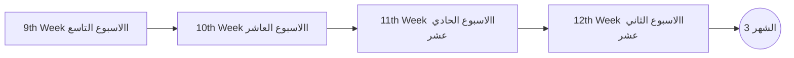
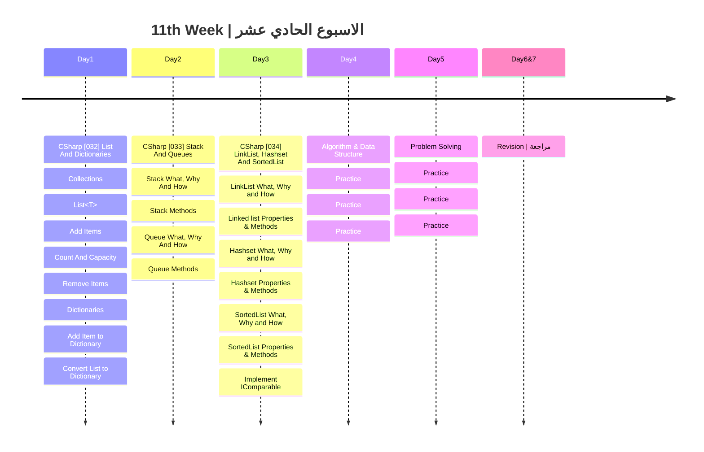

## الشهر الثالث

###  الهدف من الاسبوع الحادي عشر

- فهم القوائم والقواميس (Lists and Dictionaries): إتقان استخدام القوائم والقواميس، وفهم العمليات الأساسية مثل الإضافة والإزالة.
- استكشاف (Stacks and Queues): تعلم كيفية استخدام الأسطاك والطوابير والطرق المرتبطة بهم.
- فهم LinkList, HashSet, و SortedList: التعرف على هذه الأنواع المتقدمة من البيانات وكيفية استخدامها.
- تطبيق الخوارزميات والهياكل البيانية: ممارسة تطبيق الخوارزميات والهياكل البيانية بمهارة.
- حل المشكلات: تطوير القدرة على حل المشكلات البرمجية بشكل فعّال.
- مراجعة شاملة: لا يمكن أن ننسى هذا الجزء، مراجعة ما تم تعلمه وتحديد المجالات التي قد تحتاج إلى تحسين.

|Lesson | Link |
| :---: | :---: | 
|CSharp [032] | https://youtu.be/HNmAzIRfwoI|
|CSharp [033] | https://youtu.be/-GpTnKa0myM|  
|CSharp [034] | https://youtu.be/BKYiNKfmuGk|   

---
