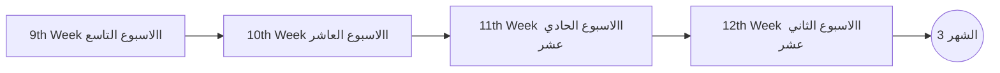
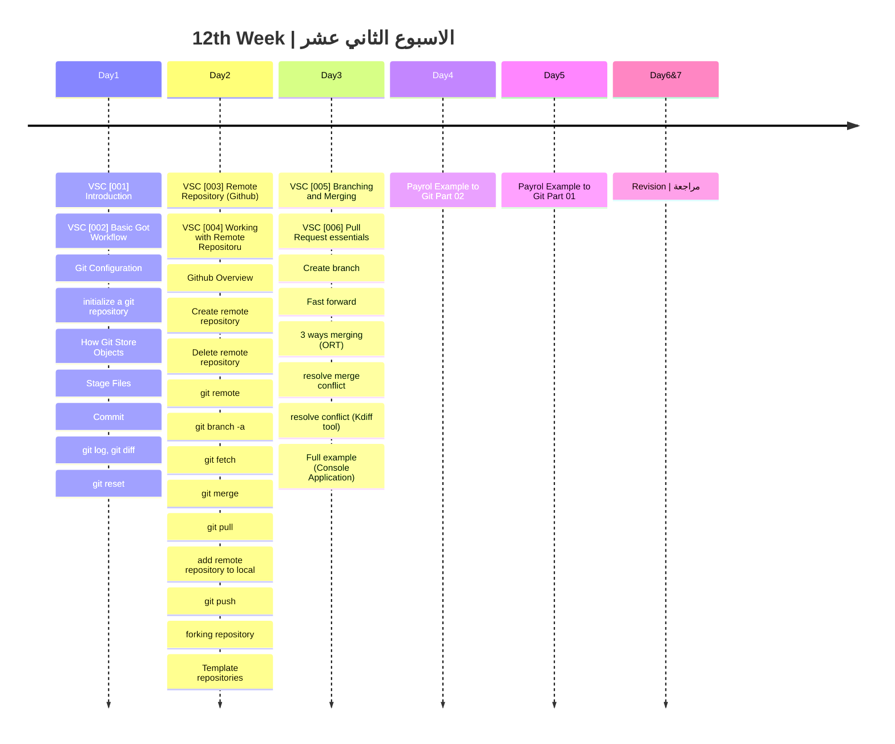

## الشهر الثالث

###  الهدف من الاسبوع الثاني عشر
- تقنيات Git وVSC: فهم أساسيات عمل Git وVisual Studio Code، بدءًا من التكوين وحتى الCommit.
- التفاعل مع (Remote Repositories): تعلم كيفية إنشاء وحذف وإدارة المستودعات البعيدة على Github.
- فروع ودمج في Git (Branching and Merging): تعلم كيفية إنشاء وإدارة، وكيفية حل التعارضات في الدمج.
- تطبيق عملي (Payroll Example): توضيح كيفية استخدام Git في مشروع حقيقي من خلال مثال عملي.
- مراجعة شاملة: نعم، هذا جزء لا يمكن تجاهله. مراجعة ما تم تعلمه وتحديد المجالات التي قد تحتاج إلى مزيد من التركيز.

|Lesson | Link |
| :---: | :---: | 
|VSC [001] | https://youtu.be/vmKeIpVaPvQ|  
|VSC [002] | https://youtu.be/VxMFMgnpV3A|  
|VSC [003] | https://youtu.be/1KDXTQvmPbo|  
|VSC [004] | https://youtu.be/K7cGrHdO4Ow|  
|VSC [005] | https://youtu.be/o2PW8xe5CSk|  
|VSC [006] | https://youtu.be/GwKLwJgm7Qw|  

---
