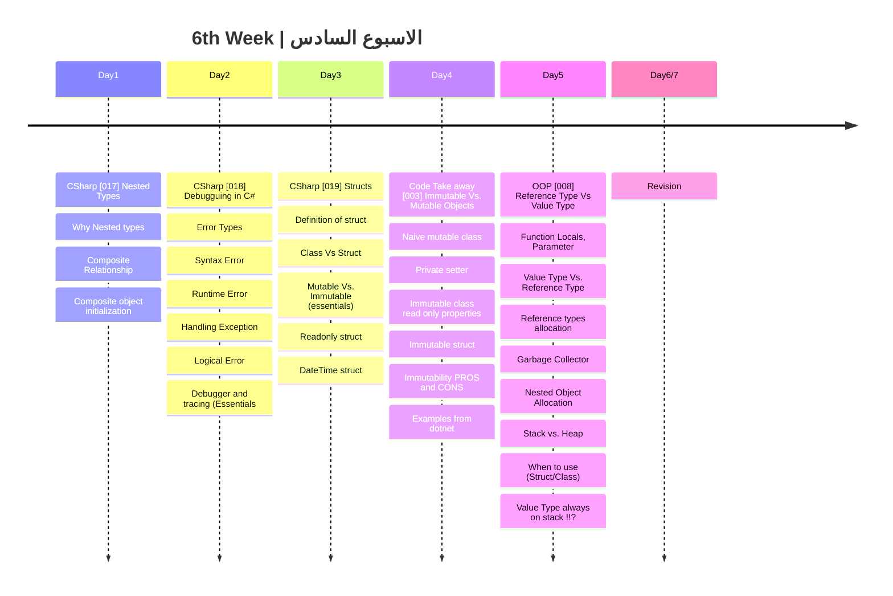

## الشهر الثاني

###  الهدف من الاسبوع السادس
- الانواع المتداخلة (Nested Types)
- استكشاف الاخطاء ومعالجتها (Debugging and Tracing)
- التعرف على Struct
- الفرق بين (Reference Type) و (Value Type)
- الفرق بين (Immutable) و (Mutable)

|Lesson | Link |
| :---: | :---: | 
|CSharp [017] | https://youtu.be/-gWx_NILonQ | 
|CSharp [018] | https://youtu.be/mkOAASe1VMk|
|CSharp [019] | https://youtu.be/rhupFUHBwvY|
|Code Take Away [003] | https://youtu.be/bbdmknnwcP8| 
|OOP [008] | https://youtu.be/oQI0ItmX-H0|

---
