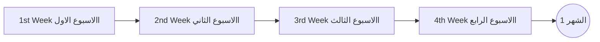
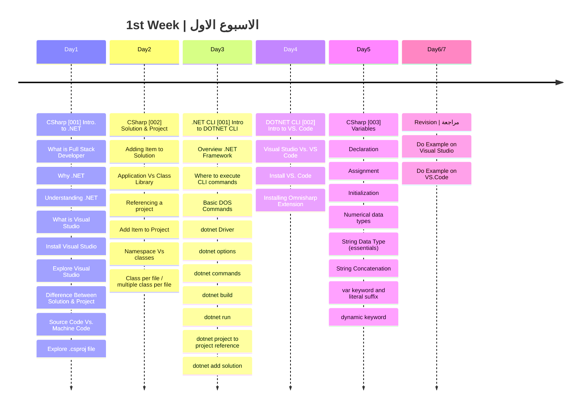

### يفترض في من يريد متابعة خارطة الطريق ان يكون خريج حاسبات او هندسة حاسبات او اي تخصص قام بشرح اساسيات علوم الكمبيوتر او دورة اوفلاين او اونلاين
### لكل من ليس له علاقة ب علوم الحاسب ويريد متابعة خارطة الطريق الرجاء اكمال دورة CS50 من جامعة هارفرد فهي تمثل تمهيد جيد للبدء في التراك

رابط الدورة:  [CS-50 Harvard](https://cs50.harvard.edu/x/2023/#welcome) 
رابط دورة : [Introduction To Programming MIT](https://ocw.mit.edu/courses/6-0001-introduction-to-computer-science-and-programming-in-python-fall-2016/)

  ## الشهر الأول

###  الهدف من الاسبوع الاول
- التعرف منصة الدوت نت واصداراتها المختلفة
- كيفية تهيئة جهاز الكمبيوتر الخاص فيك للبدء في عمل تطبيقات دوت نت عليه
- التعامل مع بيئات التطوير
- كيفية عمل البرنامج والتعامل مع السوليوشن والمشروع باستخدم ال GUI و Command Line
- التعامل مع عناصر التطبيق
- عمل اول تطبيق باستخدام بيئات التطوير المختلقة (Visual Studio / VS. Code)
- الفرق بين الكود المصدري (Source Code) ولغة الالة (Machine Code)
- التعرف على مبادئ واساسيات المتغيرات والتعامل معها
- معرفة الفرق بين ال (namespace) و (class)
  

|Lesson | Link |
| :---: | :---: | 
|CSharp [001] | https://youtu.be/TxaZYXtZWCM |
|CSharp [002] | https://youtu.be/t2aMZFzV3jI |
|.NET CLI [001] |https://youtu.be/3FaIaGzbjMs|
|.NET CLI [002] | https://youtu.be/ykfeeBeGAMk |
|CSharp [003] | https://youtu.be/j87UkenRf7k|

---
