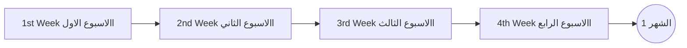

  ## الشهر الأول



 ```mermaid
timeline
    title 2nd week | الاسبوع الثاني
    Day1 : CSharp [004] Boolean Types & Operators
         : Equality Operators
         : Comparison Operators
         : Conditional Operators
         : Short circuit & logical operators 
         : Ternary Operator
    Day2 : CSharp [005] Arrays in CSharp
         : What is an Array
         : How It's stored
         : Declaration One Dimension
         : Initialization One Dimension
         : Multi Dimensional Array
         : Jagged Array
         : Indices and Ranges
         : Bound Checking
    Day3 : CSharp [006] Expressions in C#
         : Expression Types
         : Binary Operators
         : Null Coalescing "??"
         : Null conditional "?."
         : Statement vs Statement blocks
         : statement Expression
         : Selection statement
         : Iterations
         : jump statements
    Day4 : Problem Solving 1
         : Simple calculator
         : Sum Array elements
         : Find Average of numbers
         : Find max number in array
         : Find Min Number in Array
    Day5 : Problem Solving 2
         : FizzBuzz
         : Reverse String
         : Valid Palindrome
  Day6/7 : Revision | مراجعة
         : Self Practice    
```
###  الهدف من الاسبوع الثاني
- التعامل مع (Logical Operators) و (Comparison Operators) و (ُEquality Operators)
- تطبيق ال Short Circuit evaluation
- التعامل مع Ternary Operator
- التعرف على المصفوفات (Array) والتعامل مع اشكالها المختلفة (Single/Multi Dimention & Jagged) واعدادها واستخدامها وتهيئتها
- التعامل مع Array Indexes & Array Ranges والتحقق من مدى المصفوفة.
- التعامل مع Selection Statement او ما يعرف بجمل الاختيار 
   1. جملة IF
   2. جملة If/Else
   3. جملة Switch
- التعامل مع Iteration Statement او ما يعرف بجمل التكرار
   1. جملة while    
   2. جملة do-while
   3. جملة for
   4. جملة foreach
- التعامل مع Jump Statement او ما يعرف بجمل القفز
   1. جملة break 
   2. جملة continue
   3. جملة goto
   4. جملة return
- حل 8 من المشاكل (Problem Solving Easy Task)  

|Lesson | Link |
| :---: | :---: | 
|CSharp [004] | https://youtu.be/D9VD0mn6mss |
|CSharp [005] | https://youtu.be/XTB3V6R1L- | 
|CSharp [006] | https://youtu.be/eOqTJWuCXho|

---
